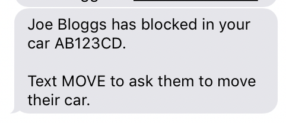
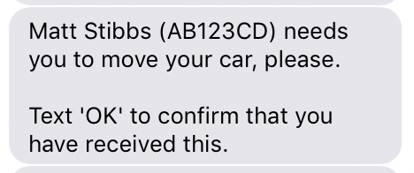
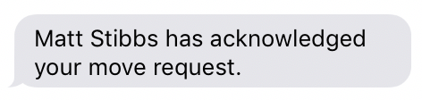

Using BlockBuster
=================
*Note: You will need to [Register with BlockBuster](getting_started.md) before you can use these commands.*

### Introduction

BlockBuster provides several functions to reduce the stress of a congested car park.

Commands are easily sent from your phone via SMS, often with a single-letter shortcut available.

You can:

* Find out who owns a car by the registration number
* Notify that you're blocking someone in
* Update when you're no longer blocking people in

You can also:

* Be notified when someone else blocks you in
* Request that someone moves their car

The system resets at **00:00** each day, meaning that any blocks left from the previous day will be cleared.

### 'Do Not Disturb' Mode
BlockBuster will not send notifications, or respond to commands between **20:00 and 08:00**. 

This is to avoid you receiving notifications when you don't need them.
 
## Blocking another car
When you block another car, you send a `BLOCK` command to BlockBuster.
```
BLOCK AN53 TRF
```

You can also use the shortcut `B` i.e.
```
B AN53 TRF
```

### Blocking multiple cars
You can include several cars in the same `BLOCK` command
```
B AN53 TRF GH65 FGH TH51 ASD
```

## Being blocked in
If someone else blocks your car, you will receive an SMS notification such as:




## Asking someone to move
Because BlockBuster keeps track of 'blocks', you can easily ask them to move by replying with:
```
MOVE
```
or
```
M
```

When you ask someone to move, you will receive a confirmation with their contact information included. 
This allows you to make direct with them if need be.

### Being blocked by multiple cars
*Note: If you've been blocked in by multiple cars, sending the `MOVE` command will notify all of those cars.*

## Request a car is moved by registration
You might occasionally find that someone is blocking you in, but didn't notify BlockBuster.  
In this situation, you can ask someone to move using their registration:
```
MOVE AB51JKL
```
Providing that their car is in the database, they will still receive a notification asking them to move.



## Acknowledge a request to move your car
When you receive a notification asking you to move, you can let the 'blockee' know that you are responding by replying:
```
OK
```

This will let the 'blockee' know that you are responding to their request.

 

## Unblocking cars
When you are no longer blocking cars in, you should let BlockBuster know.

To simply unblock all cars that you were blocking, send:
```
UNBLOCK
```
or
```
U
```

If there is a specific car that you are unblocking, include the registration:
```
U AB124FG
```

Unblocking is most useful if you are leaving before the end of the day, as it can let others know that they're now not blocked in. 
You should try and use it if you think it help someone else to know.

However if you don't unblock or are leaving along with your colleagues at the end of the day, you can leave the system to reset the blocks overnight.

## For additional support
Please drop a mail to **<blockbuster@stibbsy.co.uk>**
