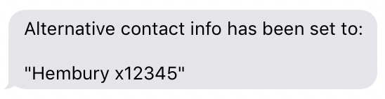

BlockBuster Instructions
========================

Getting Started
---------------

You interact with BlockBuster via SMS text message commands. This is cross-platform compatible, and guarranteed to work on any mobile phone :)

Text messages to BlockBuster are included within your free SMS allowances.

```
Commands in a code block like this should be sent as SMS messages
```


## Registration

1. Firstly, find out the mobile number for your version of BlockBuster. 
 
2. Add this number to your mobile phone contacts with a clear name such as 'BlockBuster App'.

3. Register your car with Blockbuster by sending a register command in the format: 
 `REGISTER <Registration> <FirstName> <LastName>`

```
REGISTER AB12 3FD Joe Bloggs
```
Your car registration will now be linked to your mobile phone number.

### Un-registering 

You can un-register from BlockBuster at any point with `UNREGISTER <Registration>`

```
UNREGISTER AB123FD
```

## Configuring Contact Details

By default, your mobile phone number will be used for:

* Sending you notifications
* Sharing with people who need you to move your car 

If you want to provide some alternative contact details, you can use the following commands.

### Alternative Contact Information
#### Provide some alternative contact details
```
SET CONTACT Hembury x12345
```


#### Clear your alternative contact details
You can clear your alternative contact information with:
```
SET CONTACT CLEAR
```

### Mobile Number Sharing
When people ask you to move your car, your mobile number will be shared with them by default. 
The idea behind this is that it allows them to call you directly if they need to get hold of you.

#### Disabling Sharing
If you don't want to share your mobile number with others, you can disable it with:

```
SET CONTACT MOBILE OFF
```

*Note: You should provide some alternative contact information if you disable mobile number sharing.*

#### Enabling Sharing
To re-enable mobile number sharing:

```
SET CONTACT MOBILE ON
```

## You're ready to go! 
Now you're all registered you can starting using the service!

## [Usage Instructions](commands.md) 
